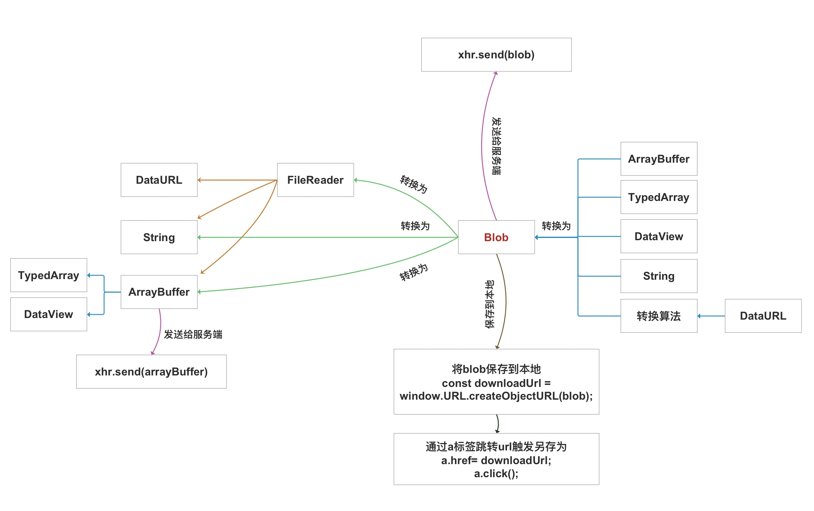
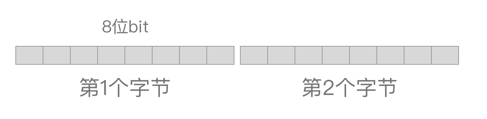
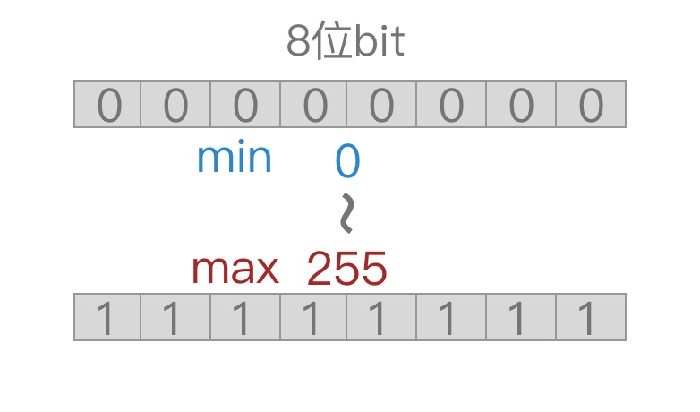
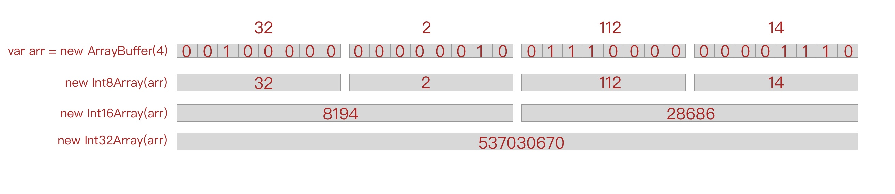

# Blob / ArrayBuffer / File 二进制数据

> 发表日期：2021-11-15

先来看一张blob数据类型转换的闭环图，上面展示了和blob相关的数据类型关系图，我们将围绕这张图来学习blob的数据类型转换、存储、接口通信中的运用




### ArrayBuffer  
* 官方解释：  
  一个通用的二进制数据缓冲区，它是一个`字节数组`  
* 通俗理解：  
  ArrayBuffer是一片数据占用的内存区域，而Blob等对象是操作、管理这片内存区域的对象，没有ArrayBuffer就没有Blob。  
* 常用方法：
  * new ArrayBuffer(字节数): new ArrayBuffer(2)时代表从内存中申请了`2个字节`的空间。   
  * arr.byteLength: 占用字节数  
  * arr.slice(start,end): 返回第start字节至第end字节的数据  
* 特性：
  * ArrayBuffer是一个只读对象  
  * 要修改它存放的数据必须借助其他工具对象来读写，比如`TypedArray`和`DataView`对象

### Blob  
* 官方解释：  
  以`文本或二进制`的格式存放的数据，它可以是任何类型的数据比如图片、音频、视频等  
* 通俗理解：  
  ArrayBuffer基础管理的对象，描述存放的数据是哪类格式数据
* 特性:  
  Blob是一个`只读对象`，如果想改变它的数据则必须将它转换为其它数据类型再进行修改  
* 常用的方法:  
  * blob.text(): 将blob转换为字符串
  * blob.arrayBuffer(): 将blob转换为ArrayBuffer
  * blob.slice(start,end): 提取blob数据从start到end的部分

#### File  
它继承自Blob，拥有Blob的所有功能并加以扩展，目的是帮助用户从当前系统上获取文件。
> 我们可以将任何想转化为Blob对象的数据转换成File对象


#### 温习：1个字节  
1字节 = 8位  
16位系统中，1字(word) = 2字节(byte) = 16位(bit)  
32位系统中，1字(word) = 4字节(byte) = 32位(bit)  

总结：我们提到1个字节的时候代表就是一个8位的内存空间，不用把系统的位数考虑进去  
在内存中，最小单位就是字节，就像下面图上内存的排列顺序：  


##### 有符号、无符号  
1个字节的内存可以表示的最小和最大数值是`0-255`，对应16进制`0x00  ~  0xFF`  
如果这1个字节是带符号的那么去掉第1位用来表示正负外，剩下只有7位可以使用，最小和最大值就变成了 `-128 ~ 127`




### TypedArray  
Uint8Array,Int8Array等9个对象统称为TypedArray，用来操作ArrayBuffer内数据的媒介，特点是将ArrayBuffer按照规定数据类型的长度进行切割读取  

如下图举例: 
1. 假设一个4字节的ArrayBuffer里面存放的4个字节分别是 32、2、112、14   
2. 使用Int8Array来读取这4个字节时，代表用8位作为一个单位读取，那么结果正好是array[4]=[32,2,112,14];  
3. 使用Int16Array来读取这4个字节时，代表用16位为一个单位读取，结果是array[2]=[8194,28686]，因为32和2这2个8位组成的16位二进制转换成十进制的结果是8194，以此类推  
4. 理解了上面的转换方法，Int32Array就好理解了，它用1个32位单位读取，结果为array[1]=[537030670]  


### DataView  
用于操作ArrayBuffer的工具类，特点是可以随意读取或写入任意位任意类型的数据。

### TypedArray 和 DataView 区别
我们拿数据进行一次读一次写的操作来对比


```javascript
// TypedArray 提前将数据按照统一的规格切分好，然后通过数组下标访问
const buffer = new ArrayBuffer(4);//假设buffer内的数据是[32,2,112,14]
const arr = new Int8Array(buffer);
console.log(arr);//[32,2,112,14]
arr[1]=64;//这里将原来的2变更为64
console.log(arr);//[32,64,112,14]
```

```javascript
// DataView 可以自由的访问数据中任何位置上的数据
const buffer = new ArrayBuffer(2);//假设buffer内的数据是[32,2,112,14]
const view = new DataView(buffer);
view.getInt8(0);//从第0个字节开始，读取一个INT8数据，结果为32
view.setInt8(1,64);//从第1个字节开始，写入一个INT8值为64的数据,写入后数据变为[32,64,112,14]
```
> 如果这里我们执行 view.setInt16(1,64) 会怎么样?
> 答案是内存溢出，抛出错误


#### TypedArray和DataView的选择？  
1. 大部分时候DataView比较适用
2. 当数据是以每一位是固定长度的比如Int8或者Int32存储的时候，用TypedArray较方便


### 数据类型转换


回到闭环图上可以看到 ArrayBuffer、String、DataURL、DataView、TypedArray 这些对象可以直接转换为blob对象  
而其中最常用的可能是 ArrayBuffer、String、DataURL，这3类了,下面我们逐一举例他们之间如何进行转换的

* ArrayBuffer <--> Blob  
```javascript
  // arrayBuffer -> blob
  const arr = new ArrayBuffer(2);
  const blob = new Blob([arr]);
  // blob -> arrayBuffer
  // 方法一：
  blob.arrayBuffer().then(res=>console.log(res));
  // 方法二：通过FileReader对象
  var reader = new FileReader();
  reader.readAsArrayBuffer(blob);
  reader.onload =  (e)=> {
    console.log(e.target.result);
  }
```
* String <--> Blob  
```javascript
  // string -> blob
  const str = 'hello';
  const blob = new Blob([str]);
  // blob -> string 
  // 方法一： 直接使用blob.text方法
  blob.text().then(res=>console.log(res));//打印 hello
  // 方法二：通过FileReader对象
  var reader = new FileReader();
  reader.readAsText(blob,'utf-8');
  reader.onload =  (e)=> {
    console.log(e.target.result);//打印hello
  }
```
* DataURL <--> Blob  
```javascript
  // DataURL -> blob
  const dataUrl = 'data:image/png;base64,iVBORw0KGgoAAAANSUhEUgAAABkAAAAZAQMAAAD+JxcgAAAABlBMVEX/hwD/AConRoO6AAAAE0lEQVQI12PACZibGxAENWURAABAgAk3rRLq4QAAAABJRU5ErkJggg==';
  // 将dataurl数据转码
  const dataURLToUint8Array=(dataurl)=>{
    const arr = dataurl.split(',');
    const mime = arr[0].match(/:(.*?);/)[1];//读取文件类型
    const bstr = window.atob(arr[1]);//将数据部分从base64编码解码为字符串
    let n = bstr.length;
    const u8arr = new Uint8Array(n);//申请内存空间
    while (n--) {
        u8arr[n] = bstr.charCodeAt(n);//将字符转化 Unicode 编码
    }
    return {arr:u8arr,mime:mime};
  }
  const {arr,mime} = dataURLToUint8Array(dataUrl)
  const blob = new Blob([arr],{type:mime});
  // blob -> DataURL 
  var reader = new FileReader();
  reader.readAsDataURL(blob);
  reader.onload =  (e)=> {
    console.log(e.target.result);//打印结果同 dataUrl
  }
```
* DataView <--> Blob  
```javascript
  // DataView -> blob
  const arr = new ArrayBuffer(2);
  const dataView = new DataView(arr);
  dataView.setInt8(0,64);//第1个字节处写入64
  dataView.setInt8(1,65);//第2个字节处写入65
  const blob = new Blob([dataView]);
  // blob -> arrayBuffer -> DataView
  blob.arrayBuffer().then(res=>console.log(new DataView(res)));
```
* TypedArray <--> Blob：用Uint8Array举例  
```javascript
  // Uint8Array -> blob
  const arr = new ArrayBuffer(2);
  const uArr = new Uint8Array(arr);
  uArr[0]=64;//第1个字节处写入64
  uArr[1]=65;//第2个字节处写入65
  const blob = new Blob([uArr]);
  // blob -> arrayBuffer -> Uint8Array
  blob.arrayBuffer().then(res=>console.log(new Uint8Array(res)));
```

> 我们可以将任何我们需要转换为blob的数据通过闭环图来找出转换路径
> 而如果你需要处理的数据不是闭环图上的数据类型，那么就要试图将数据先转换为我们闭环图上的这些数据

* 图片 <--> Blob  
```javascript
  // img --> blob
  const img = new Image();
  img.onload=()>{
    const canvas = document.createElement('canvas');
    const ctx = canvas.getContext('2d');
    canvas.height = img.height
    canvas.width = img.width
    ctx.drawImage(img, 0, 0)
    canvas.toBlob((imgBlob)=>{
      console.log(imgBlob)
    });
  }
  img.src=url;

  // 方法二:img --> dataURL --> blob
  const img = new Image();
  img.onload=()>{
    const canvas = document.createElement('canvas');
    const ctx = canvas.getContext('2d');
    canvas.height = img.height
    canvas.width = img.width
    ctx.drawImage(img, 0, 0)
    const dataUrl = canvas.toDataURL();
    // 接下去走dataURL-->blob流程即可
  }
  img.src=url;
```

### 存储：将Blob数据另存为到本地  
只要是blob对象，我们就可以通过`URL.createObjectURL`将其转换为blobUrl然后通过a标签加载blobUrl触发浏览器的另存为动作将它保存下来  
```javascript
  // 生成blob url
  const blobUrl = window.URL.createObjectURL(blob);

  // 利用a标签触发浏览器另存为动作
  const a = document.createElement('a')
  a.href = blobUrl
  a.download = 'file.png' //另存为时默认的文件名称
  document.body.appendChild(a);
  a.style.display = 'none'
  a.click()
  a.remove();

  //释放资源，一旦资源释放，原先的blob url再加载时就是404咯！！
  setTimeout(() => window.URL.revokeObjectURL(blobUrl), 1000);
```

### 网络获取：从接口返回获取blob  
```javascript
var xhr = new XMLHttpRequest();
xhr.open('GET',`url`);
// 要求返回的数据转换为blob,此时不管服务端返回的数据为哪类，都会被转换为blob
xhr.responseType = 'blob';
xhr.onreadystatechange=function(){
  if (xhr.readyState==4 && xhr.status==200){
    console.log(xhr.response);//此时xhr.response为blob对象
  }
}
xhr.send();
```
> 小总结：
> 如果希望返回的数据为arraybuffer则将xhr.responseType改为arraybuffer即可
> responseType设置为arrayBuffer和blob对于后端没区别
> 对于前端在blob模式下其实就是将arrayBuffer转换成blob放在xhr.response内，所以我们可以直接使用blob模式处理较方便

#### 顺带提一下`Content-Type`的作用

`Content-Type`是用来告诉对方本条消息的主体内容是哪种数据类型的

##### Request中的`Content-Type`  
一般由于服务端对于接口接收的数据是提前规范好的，通常不会参考`Content-Type`，当然你可以利用它来做些事情

##### Response中的`Content-Type`  
方便浏览器识别特殊文件类型而做出一些默认行为，比如展示、另存为等  
举例：我们有一个get接口，用于返回png图片的数据如下，  
```javascript
router.get('download/png',async (ctx, next) => {
  await next();
  let data = fs.readFileSync("./temp1.png")
  // 1、ctx.type='image/png';
  // 2、ctx.type='.mp4';
  // 3、不指定任何东西
  ctx.body=data;
});
```
* 以上3种情况下在浏览器直接输入接口地址会有什么反应？  
  1. 浏览器直接展示出了图片  
  2. 浏览器中出现一个播放器试图播放，但是因为我们这个是图片结果是播放不出任何东西的  
  3. 浏览器跳出了另存为界面，因为不指定content-type时，会根据返回的数据body类型来自定设定，这里默认将content-type设置成了`application/octet-stream`二进制数据，二进制数据则会触发另存为动作;  


* 如果是通过ajax来调用上面接口会有什么反应？  
  答案是不会有任何反应，ajax方式调用需要我们人为手动对response进行判断，手动去触发展示或者另存为等行为

> 小总结：
> 实际应用中Content-Type最常用在GET请求的response中，辅助浏览器来做出展示、另存为等动作
> 结合`Content-Disposition: attachment; filename="filename.jpg"` 可以设定浏览器弹出另存为时默认的文件名


### nodejs服务端如何将数据以二进制形式返回    
以nodejs koa为例服务端将数据以buffer形式放在body传回即可  
```javascript
//nodejs koa案例
router.get('download/blob',async (ctx, next) => {
  await next();
  //从本地读取文件，这里要注意不要指定{encoding:'binary'}，encoding一旦指定代表将buffer转换为了字符串形式
  let data = fs.readFileSync("./temp1.png");
  // 可有可无
  // ctx.type='application/octet-stream';
  // 或
  // ctx.type='.png'
  //将文件buffer直接给body传回
  ctx.body=data;
});
```
