# 使用JSDoc进行代码注释及文档生成


利用JSDoc我们可以解决三大问题：

1、代码的注释规范  
2、代码智能提示     
3、markdown及html文档输出    


#### 代码智能提示

**对象成员提示**
<!-- panels:start -->
<!-- div:left-panel -->
使用前
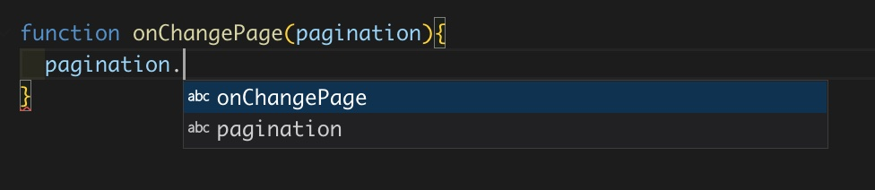
<!-- div:right-panel -->
使用后
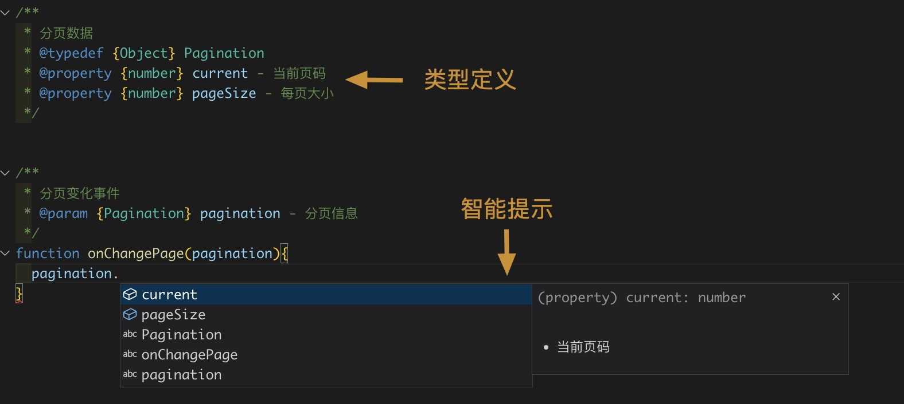
<!-- panels:end -->

**函数调用时的入参提示**
<!-- panels:start -->
<!-- div:left-panel -->
使用前

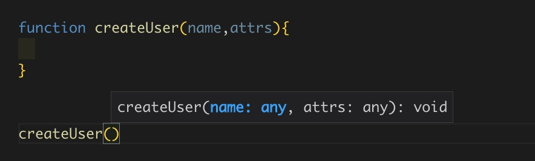
<!-- div:right-panel -->
使用后

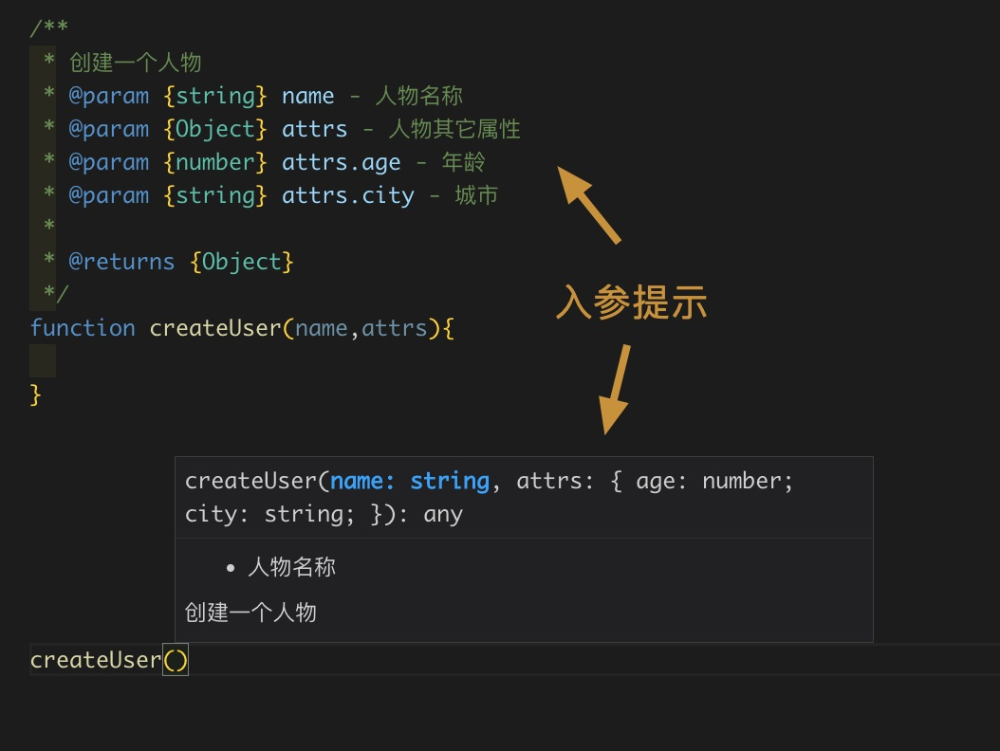
<!-- panels:end -->


**再来看一个带方法的对象结构**
<!-- panels:start -->
<!-- div:left-panel -->
使用前

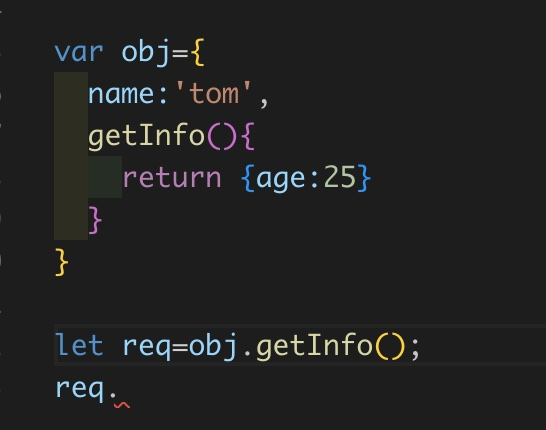
<!-- div:right-panel -->
使用后

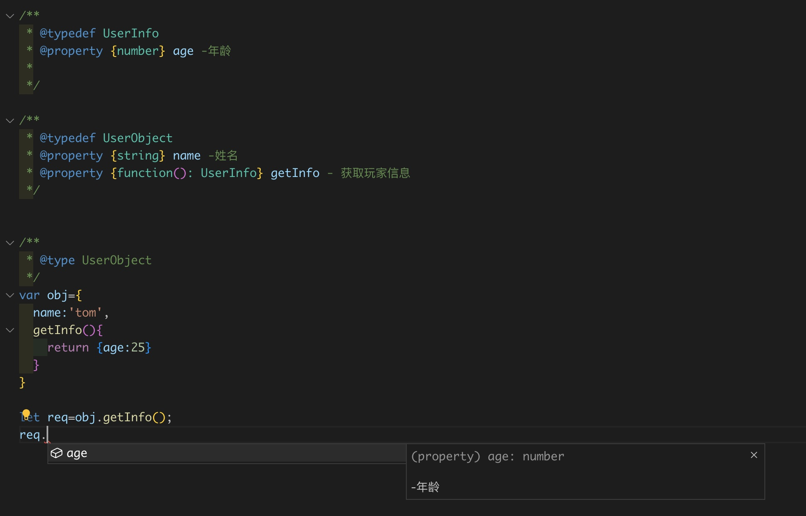
<!-- panels:end -->


**React中class组件的应用**
<!-- panels:start -->
<!-- div:left-panel -->
使用前

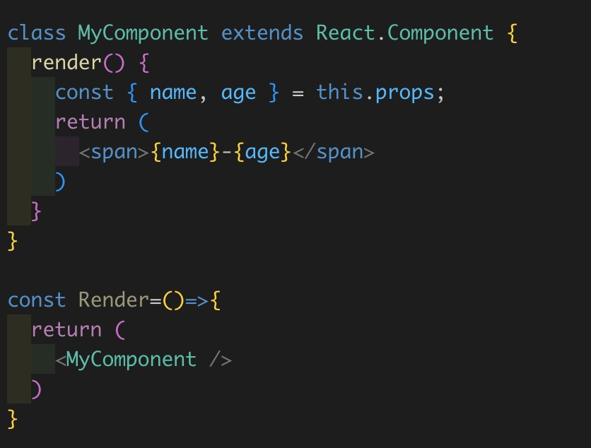
<!-- div:right-panel -->
使用后

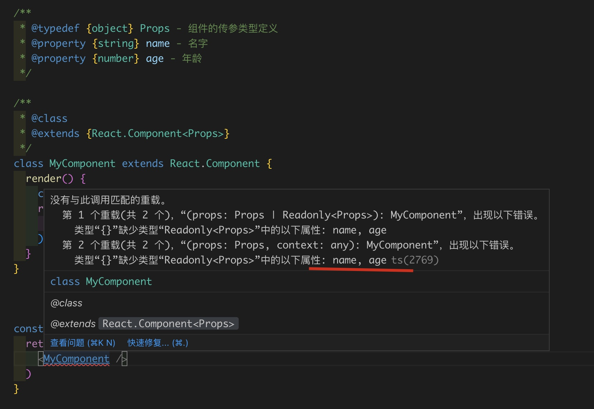
<!-- panels:end -->

**React中function组件的应用**
<!-- panels:start -->
<!-- div:left-panel -->
使用前

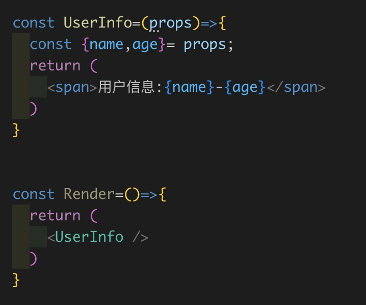
<!-- div:right-panel -->
使用后

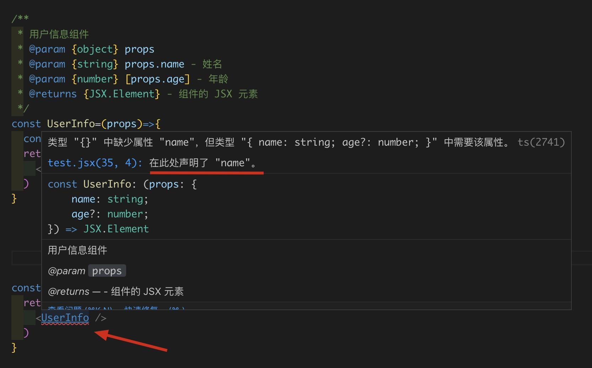
<!-- panels:end -->

**可以看到，通过vscode内部集成的jsdoc的支持，我们使用jsodc注释规范对代码进行注释后，vscode可以发会更强大的智能提示，接近ts的效果，我们几乎可以使用jsdoc+jsconfig.json配置来替代ts**

#### jsconfig.json
要实现vscode对上面jsdoc的更好的支持，我们需要在项目根目录下配置`jsconfig.json`用于告知vscode如何来进行类型检查
```json
{
  "compilerOptions": {
    "baseUrl": ".",
    "checkJs": true, // 启用对 JavaScript 文件的类型检查
    "jsx": "react",//支持react
    "paths": {
      "@/*": ["./public/src/*"]
    }
  }
}
```


#### 文档输出  

下面是同一个代码段生成的html文档和markdown文档


**html版本**
<iframe style="height:600px;" src='./assets/jsdoc/html/docs/module-useCounter.html'></iframe>

**markdown版本**
<iframe style="height:600px;" src='./assets/jsdoc/markdown/index.html'></iframe>


#### 如何使用？

1. 安装 `npm i jsdoc -D`   
2. 给代码添加注释   

```javascript
  /** 
   * 一般放在文件头部，用来定义整个文件属于哪个模块，下面的内容权属于这个模块下
   * @module usePagination
  */

  /**
   * 定义一个数据结构叫:分页信息
   * @typedef {Object} Pagination
   * @property {number} current - 当前页码
   * @property {Object[][]} data - 分页数据集合
   */


  /**
   * 分页切换方法
   * @param {Pagination} page - 分页信息
   * @return {boolean} 切换结果
   * /
  function changePagination(page){

  }

```

3. 执行创建文档`./node_modules/.bin/jsdoc src/**/*.js --configure .jsdoc.json --verbose`  
> .jsdoc.json为配置文件，可有可无,这里我使用了第三方的主题样式，所以配置了关于它样式的信息  
``` json
{
  "opts": {
    "destination": "./docs/",//输出目录
    "encoding": "utf8",
    "private": true,
    "recurse": true,
    "template": "./node_modules/docdash",//主题样式包所在位置
    "verbose": true
  },
  "plugins": ["plugins/markdown"],//插件定义
  "templates": {
    "cleverLinks": true,
    "monospaceLinks": true
  },
  "docdash": {// 主题样式自己的配置字段
    "search": true,
    "typedefs": true,
    "collapse": true
  }
}
```


#### 创建markdown文档
1. 安装`npm i jsdoc-to-markdown -D`    
2. 调用jsdoc2md生成文档：`./node_modules/.bin/jsdoc2md --plugin ./dmd/lib/index.js --files src/useRollingPagination/*.js src/useSwitch/*.js > api.md`  
  参数解释：  
  `--plugin ./dmd/lib/index.js`:代表需要加载的自定义插件，如果没有则可以不用写  
  `--files src/useRollingPagination/*.js src/useSwitch/*.js`: 需要编译哪些js来输出文档    
  `> api.md`：将编译后结果统一输出到api.md内    


#### 进阶玩法：如何个性化自己的markdown文档样式?
可能你对默认的markdown样式不太满意，想根据自己项目特点来修改样式(比如上面的案例中的--plugin内索指向的入口就是自己编写的插件入口)  
jsodc支持自定义插件模板，所以我们可以拦截编译结果进行自定义输出  
参考 [dmd](https://github.com/jsdoc2md/dmd) 来编写插件，插件的目录大致如下：

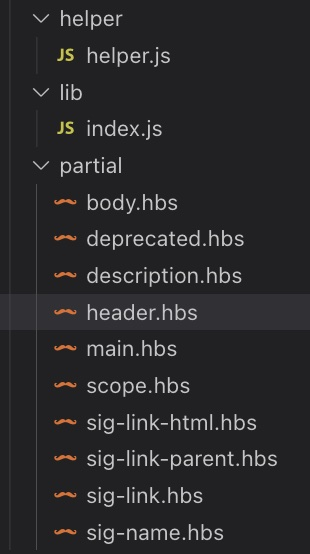

* `helper/helper.js`：主要放处理字符串的方法，可以重写原始的一些通用方法  
  这里举例我们编写一个方法用来将字符串内所有的`.`替换成`_`并小写输出，这个功能我们留着在模板内使用    
```javascript
exports.formatAnchorName = function(text,option){
    if(!text)return text;
    let req= text.replaceAll('.','_')
    return req.toLowerCase();
}
```

* `partial`:放`.hbs`模板文件,用来表述markdown内各类标签的渲染方法，`hbs`模板使用了[handlebarsjs](https://handlebarsjs.com/guide/)作为模板语言编写    
  参考[dmd-partials](https://github.com/jsdoc2md/dmd/tree/master/partials)下是默认的
  每一个文件描述了markdown内某一类代码片段的渲染方式，比如`header.hbs`描述了所有`#`开头的标题的渲染方式


* `lib/index.js`:用于描述导出的partial和helper是哪些，一般不用特殊编写,如下我们导出所有的partial和helper文件夹内的文件  

```javascript
  module.exports = function(options){
      return {
          partial: __dirname + "/../partial/*.hbs",
          helper: __dirname + "/../helper/*.js"
      };
  };

```


#### 实战一下

> 模板的入口文件是`main.hbs`，通过模板内引用其它模板来组合生成一张完整的markdown页面,所以从`main.hbs`开始，我们可以找到所有markdown标签渲染相关的文件是哪个
> [dmd-partials](https://github.com/jsdoc2md/dmd/tree/master/partials) 下是默认标准的所有hbs模板，你可以复制一份到你的插件目录下进行修改

我们以`header.hbs`模板进行讲解，默认的header.hbs如下  

```
{{>heading-indent}}{{>scope~}}{{>sig-name}}
```

参考handlebarsjs的语法知道 `{{>name}}` 代表使用 `name.hbs`模板内的内容渲染到这里

假设我们希望在所有标题前面增加一个前缀叫：这是标题。那么我们可以修改成

```
这是标题：{{>heading-indent}}{{>scope~}}{{>sig-name}}
```
现在所有输出的标题前面就会多了这几个字符

下面利用我们自己编写的方法来输出字符串，下面代码会在标题上方输出一段经过我们anchorName方法处理后的完整标题字符串

```
{{{anchorName}}}
{{>heading-indent}}{{>scope~}}{{>sig-name}}
```

按照这个基本玩儿法以此类推即可
  


本文使用的相关库：  
* [JSDoc官方文档](https://jsdoc.app/index.html)
* [jsdoc-to-markdown](https://github.com/jsdoc2md/jsdoc-to-markdown)
* [dmd](https://github.com/jsdoc2md/dmd)
