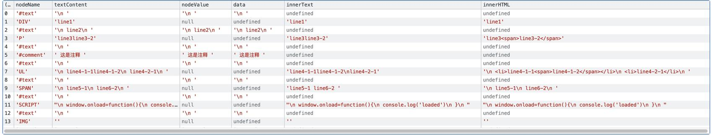
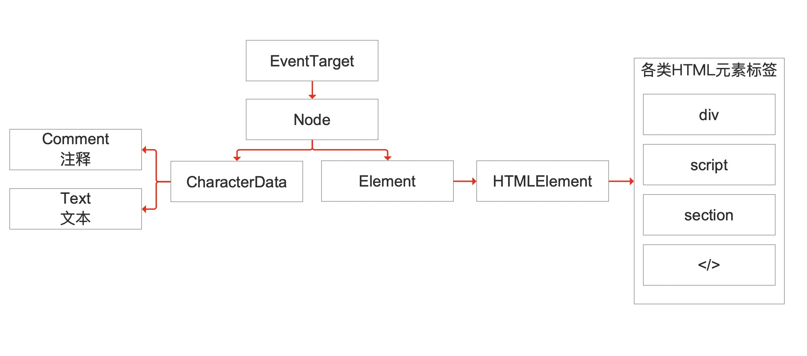

# innerText、textContent、nodeValue、data、innerHTML区别

下面是一段样本代码，我们通过遍历document.body.childNodes来看看DOM节点的innerText、textContent、nodeValue、data、innerHTML区别是什么？

```html
<body>
  <div id='log' name='title'>line1</div>
  line2
  <p>line3<span>line3-2</span></p>
  <!-- 这是注释 -->
  <ul>
    <li>line4-1-1<span>line4-1-2</span></li>
    <li>line4-2-1</li>
  </ul>
  <span>
    line5-1
    line6-2
  </span>
  <script>
    window.onload=function(){
      console.log('loaded')
    }
  </script>
  
</body>
```

下面是对照表  



属性名|归属|包含HTML标签|包含内部子节点内部的值|包含换行符
:--|:--|:--:|:--:|:--:
textContent|所有继承自Node的对象<br/>特别注意如果对象是document或doctype它会返回null|❌|✅|✅
nodeValue|所有继承自Node的对象<br/>包含当前节点值的字符串（如果有）。对于Element类型，nodeValue 返回 null。对于文本、注释和 CDATA 节点，nodeValue 返回节点的内容。对于属性节点，返回属性的值。|❌|✅|✅
data|所有继承自CharacterData的对象|❌|✅|✅
innerText|所有继承自Element的对象|❌|✅|❌
innerHTML|所有继承自Element的对象|✅|✅|✅

## 简单总结
当你需要获取节点内文本信息时(不包含源代码)，使用`textContent`会更好(innerText会引起回流)  
当你需要获取内部元素完整html源代码时，使用`innerHTML`  

## 知道了这些有什么用？
比如当我们需要比对2个dom树下的内容是否发生变更时，就可以通过对比`childNodes`下所有节点的`textContent`来比较是否发生变化  
其次获取`innerText`时会引起回流重新计算DOM树的值，所以性能较差

# 进阶  

## 节点的类型

下面这张图是HTML元素之间的继承关系


我们案例中HTML内的对象基本分为2个类别,，左边的文本类和右边的HTML标签类  

## document.body.childNodes 和 document.body.children的区别

`childNodes`:是获取节点下所有类型是Node或继承自Node的对象节点  
`children`:是获取节点下所有的`Element`节点  


