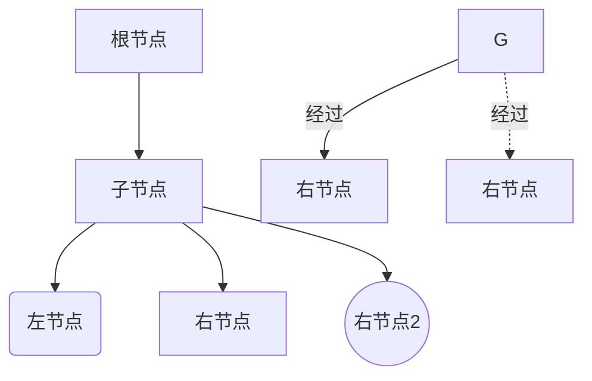

# markdown语法模板


<!-- 
### 数据异常问题分析
#### 问题1：form表单数据异常

* 初始化代码时
  代码中使用的antd的form表单，代码如下： 
  > 此时表单的数据结构是 `result[key][index]=value` 
  ```javascript
  <FormItem style={{ display: 'none' }}>
    {getFieldDecorator(`result['ID'][${index}]`, {
    })(<Input type="hidden" />)}
  </FormItem>
  <FormItem style={{ display: 'none' }}>
    {getFieldDecorator(`result['key'][${index}]`, {
    })(<Input type="hidden" />)}
  </FormItem>
  ```

* 而每次控件值发生改变时，会调用 `resetTableData` 来将处理后的值进行同步，代码如下:
  ```diff
  - 修正前的代码
  - resetTableData(array) {
  -    const { form, dispatch } = { ...this.props };
  -    dispatch(setFormFields({
  -        ITEMS_ROWS: array //同步数据倒全局变量ITEMS_ROWS内
  -    }));
  -    // 此时传入的数据结构为[{key:value,key2:value2}]
  -    form.setFieldsValue({
  -      result:array //同步数据倒表单变量内
  -    });
  - }

  + 修正后的代码
  + resetTableData(array) {
  +    const { form, dispatch } = { ...this.props };
  +    dispatch(setFormFields({
  +        ITEMS_ROWS: array
  +    }));
  +    //将原先的array数据结构进行转化,转化为 {key:[value1,value2],key2:[value3,value4]}
  +    form.setFieldsValue({result:transArray(array)});
  + }

  ```
  > 结论：由于最初传入的数据结构是错误的，导致的结果是form表单内的数据没有被正确更新，容易导致在通过form.sedFieldValue进行赋值操作的结果就会出现异常

#### 问题2：固定资产的表单内的key丢失了

代码段1：在页面渲染前会初始化 `全局变量ITEMS_ROWS`，并将每行的ID进行了赋值，而key没有赋值，导致key为空字符串

```javascript
pushIndexKeyToArray(array) {
    let newArray = ArrayAndObjectDeepClone(array);
    newArray.map((item, index) => {
        item.ID = index + 1;
    });
    dispatch(setFormFields({
        ITEMS_ROWS: newArray,//同步到了全局变量ITEMS_ROWS内
    }));
    return newArray;
  }

```

代码段2：初始化表单变量
> 这里表单初始化后，默认表单变量内  result[ID]值和resul[key]值都以ID的值赋值了
```javascript
title: '序号',
dataIndex: 'ID',
render: (text, record, index) => {
    return (
      <FormItem>
          {getFieldDecorator(`result['ID'][${index}]`, {
              initialValue: text
          })(<Input/>)}
      </FormItem>
      <FormItem >
          {getFieldDecorator(`result['key'][${index}]`, {
              initialValue: text
          })(<Input />)}
      </FormItem>
  )
}
```

代码段3：当表单值发生变化时进行数据同步

```diff
  //首先从全局变量ITEMS_ROWS取出对象进行赋值后，用全局变量调用resetTableData
  handleOtherChange(index, value) {
    let array = ArrayAndObjectDeepClone(ITEMS_ROWS);
    array[index]['other'] = value;
    resetTableData(array);
  }
  //此时进入的array.key是空的，因为ITEMS_ROWS在初始化的时候key就是空的
  resetTableData(array) {
    const { form, dispatch } = { ...this.props };
    dispatch(setFormFields({
      ITEMS_ROWS: array
    }));
-    //这里将全局变量的属性同步到form表单，此时key是空的，由于原来代码数据结构错误，所以并没同步成功，导致form表单里的key还是原来的值
-   form.setFieldsValue({result:array});
+   //而新的代码成功将array同步到form，导致key变为了空的值
+   form.setFieldsValue({result:trans(array)});
  }
``` -->


#### 高亮代码块
```diff
- 过去的代码
+ 新增的代码
```

```javascript
function add(a,b){
  return a+b;
}
```

```html
<div>html</div>
```

```css
.red{
  color:red;
}
```

```less
@import "fruits";

@rhythm: 1.5em;

@media screen and (min-resolution: 2dppx) {
    body {font-size: 125%}
}

section > .foo + #bar:hover [href*="less"] {
    margin:     @rhythm 0 0 @rhythm;
    padding:    calc(5% + 20px);
    background: #f00ba7 url(http://placehold.alpha-centauri/42.png) no-repeat;
    background-image: linear-gradient(-135deg, wheat, fuchsia) !important ;
    background-blend-mode: multiply;
}

@font-face {
    font-family: /* ? */ 'Omega';
    src: url('../fonts/omega-webfont.woff?v=2.0.2');
}

.icon-baz::before {
    display:     inline-block;
    font-family: "Omega", Alpha, sans-serif;
    content:     "\f085";
    color:       rgba(98, 76 /* or 54 */, 231, .75);
}
```

```scss
@import "compass/reset";

// variables
$colorGreen: #008000;
$colorGreenDark: darken($colorGreen, 10);

@mixin container {
    max-width: 980px;
}

// mixins with parameters
@mixin button($color:green) {
    @if ($color == green) {
        background-color: #008000;
    }
    @else if ($color == red) {
        background-color: #B22222;
    }
}

button {
    @include button(red);
}

div,
.navbar,
#header,
input[type="input"] {
    font-family: "Helvetica Neue", Arial, sans-serif;
    width: auto;
    margin: 0 auto;
    display: block;
}

.row-12 > [class*="spans"] {
    border-left: 1px solid #B5C583;
}

// nested definitions
ul {
    width: 100%;
    padding: {
        left: 5px; right: 5px;
    }
  li {
      float: left; margin-right: 10px;
      .home {
          background: url('http://placehold.it/20') scroll no-repeat 0 0;
    }
  }
}

.banner {
    @extend .container;
}

a {
  color: $colorGreen;
  &:hover { color: $colorGreenDark; }
  &:visited { color: #c458cb; }
}

@for $i from 1 through 5 {
    .span#{$i} {
        width: 20px*$i;
    }
}

@mixin mobile {
  @media screen and (max-width : 600px) {
    @content;
  }
}

```


```bash
echo "print log"
if [ -d "${HOME}/.nvm/" ]
then
  echo "==========执行 /.nvm/nvm.sh=========="
  . ${HOME}/.nvm/nvm.sh
fi
```

```json
[
  {
    "title": "apples",
    "count": [12000, 20000],
    "description": {"text": "...", "sensitive": false}
  },
  {
    "title": "oranges",
    "count": [17500, null],
    "description": {"text": "...", "sensitive": false}
  }
]
```


# 这是一级标题
## 这是二级标题
### 这是三级标题
#### 这是四级标题
##### 这是五级标题
###### 这是六级标题

#### 字体

**这是加粗的文字** 

*这是倾斜的文字*`

***这是斜体加粗的文字***

~~这是加删除线的文字~~  

#### 引用

>这是引用的内容

>>这是引用的内容

>>>>>>>>>>这是引用的内容

#### 分割线

---

#### 无序列表
* 列表第1行
* 列表第2行
* 列表第3行

#### 有序列表
1. 列表第1行
2. 列表第2行
3. 列表第3行


#### 嵌套有序列表-换行后加3个空格

1. 列表第1行
   1. 第二层第1行
   2. 第二层第2行
   3. 第二层第3行
2. 列表第2行

#### 表格
字段|类型|描述
--|:--:|--:
time|string|阻塞时间(毫秒数)
关羽 <span style="margin-left:100px;border-radius:4px;background:#ccc;padding:4px;">可选</span>|打|二哥<br/>二嫂<br/><span style="margin-left:100px;border-radius:4px;background:red;padding:4px;">默认值:ff</span>
张飞|骂|三弟

#### 超链接

[点我跳转](https://codesandbox.io/s/useswitch-qd7dr?file=/index.js)

<https://codesandbox.io/s/useswitch-qd7dr?file=/index.js>

#### 图片


#### 图片超链接

[](https://codesandbox.io/s/useswitch-qd7dr?file=/index.js)


#### 流程图 - mermaid图表


> 参考 https://mermaid-js.github.io/mermaid-live-editor/#/edit/eyJjb2RlIjoiZ3JhcGggVERcbiAgICBBW0NocmlzdG1hc10gLS0-fEdldCBtb25leXwgQihHbyBzaG9wcGluZylcbiAgICBCIC0tPiBDe0xldCBtZSB0aGlua31cbiAgICBDIC0tPnxPbmV8IERbTGFwdG9wXVxuICAgIEMgLS0-fFR3b3wgRVtpUGhvbmVdXG4gICAgQyAtLT58VGhyZWV8IEZbZmE6ZmEtY2FyIENhcl1cbiAgICAgICAgICAgICIsIm1lcm1haWQiOnsidGhlbWUiOiJkZWZhdWx0In0sInVwZGF0ZUVkaXRvciI6ZmFsc2V9
