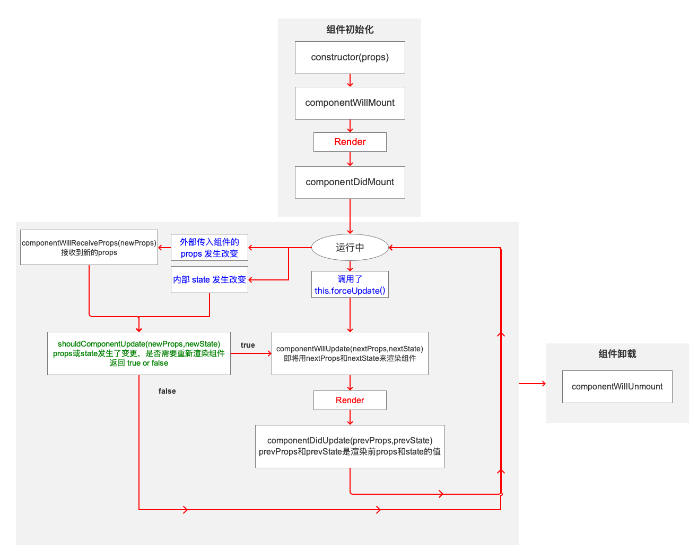
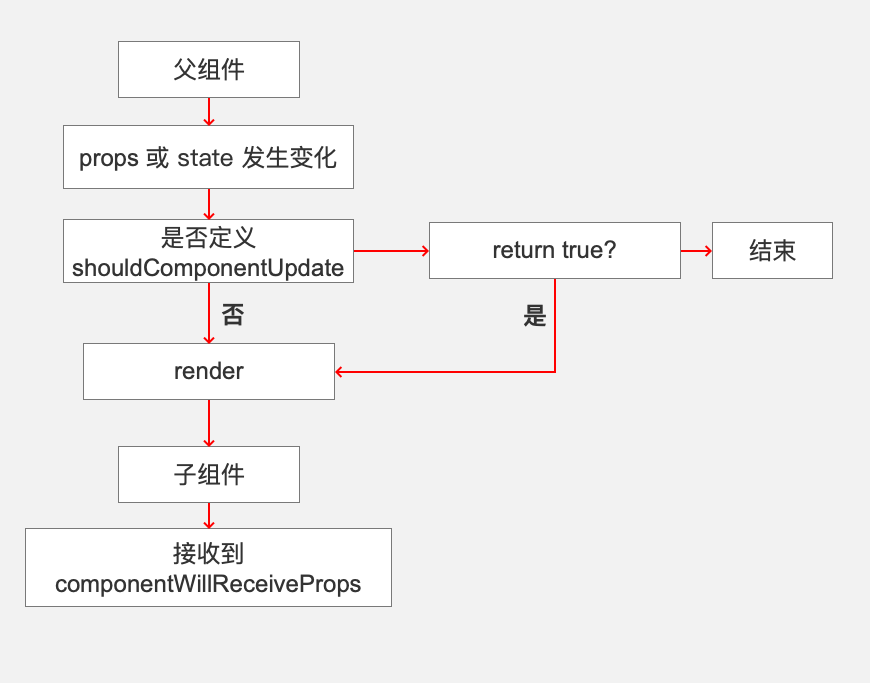
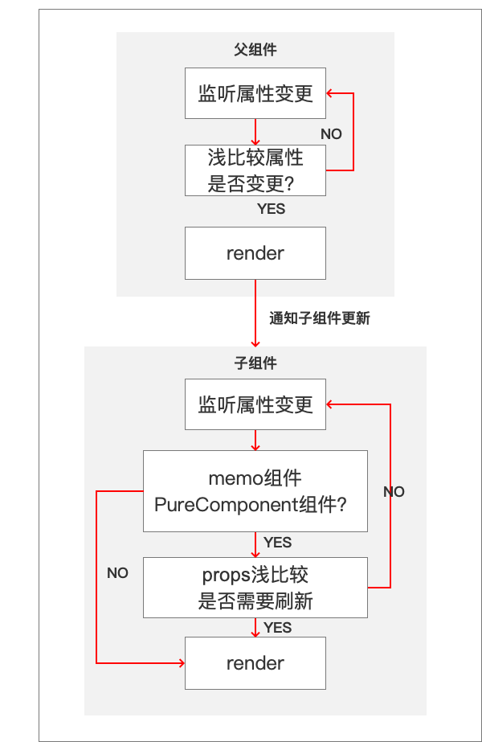

### @react组件生命周期



### @父子组件更新逻辑



### @父子函数式组件更新逻辑




### 函数式组件内模仿类组件生命周期

```javascript
// componentDidMount
function useMount(fn) {
  useEffect(() => {
    fn();
  },[]);
}
// componentDidUpdate
function useUpdated(fn) {
  const firstUpdate = useRef(true);
  useEffect(() => {
    if (firstUpdate.current) {
      firstUpdate.current = false;
    } else {
      fn();
    }
  });
}

// componentWillUnmount
function useUnMount(fn) {
  useEffect(() =>fn(),[]);
}


function Counter(props) {
  let [count, setCount] = useState(0);
  useMount(() => {
    console.log("did mount!");
  });
  useUpdate(() => {
    console.log("did updated!");
  });
  useUnMount(() => {
    console.log("did unmount!");
  });

  return (
    <div>
      <p>
        <button
          onClick={() => {
            setCount((c) => c + 1);
          }}
        >
          刷新{count}
        </button>
      </p>
    </div>
  );
}

```