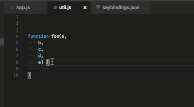
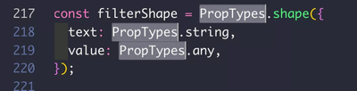
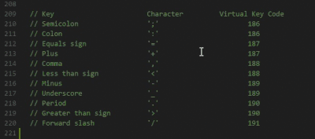
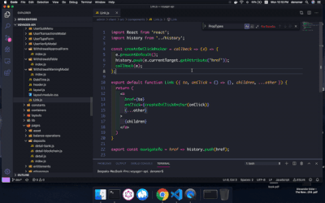
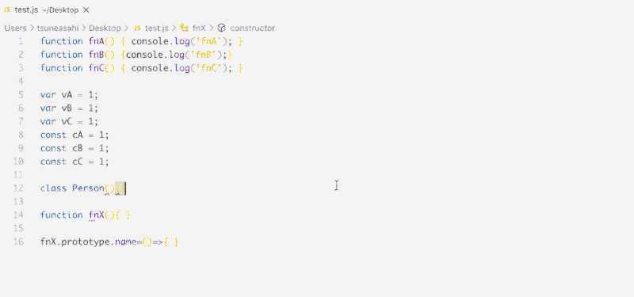

## 基础操作
#### 多行转一行

MAC: `ctrl + j`

#### 单词选中 - 同鼠标双击

MAC: `command + d`

#### 选中当前行

MAC: `command + L` 光标在当前行任何位置都行

#### 复制当前行

MAC: `command + c` 光标在当前行任何位置都行

#### 删除当前行

MAC: `command + x` 光标在当前行任何位置都行

#### 将当前行上移/下移一行

MAC: `option + 上/下` 光标在当前行任何位置都行

#### 将当前行往左/右缩进一个tab
MAC: `command + [` 或 `command + ]`

#### 块选择vs

MAC: `shift + option + 鼠标拖动`

#### 跳转到特定行
MAC: `ctrl + g`

#### 跳转到当前括号的对应一边
MAC: `shift + command + \`

## 窗口操作

#### 打开/关闭 侧边栏

MAC: `command + b`

## 查找操作

#### 在当前文件内查找变量和方法

MAC: `command + r`

#### 查找替换
MAC: `command + option + f`

#### 折叠所选的代码块
MAC: `cmd + k + 4` 其中1可以替换为4，2，3，4代表了折叠的深度级别，一般用4
